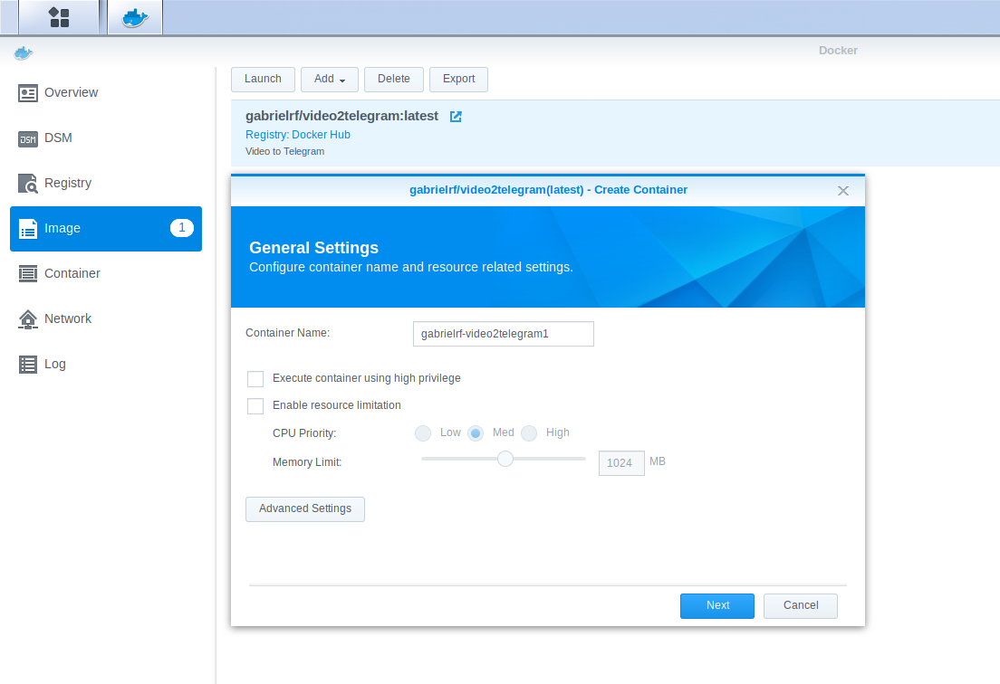
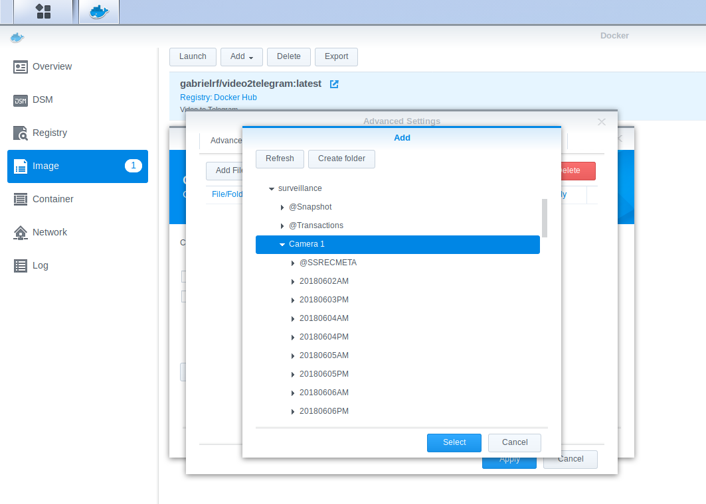
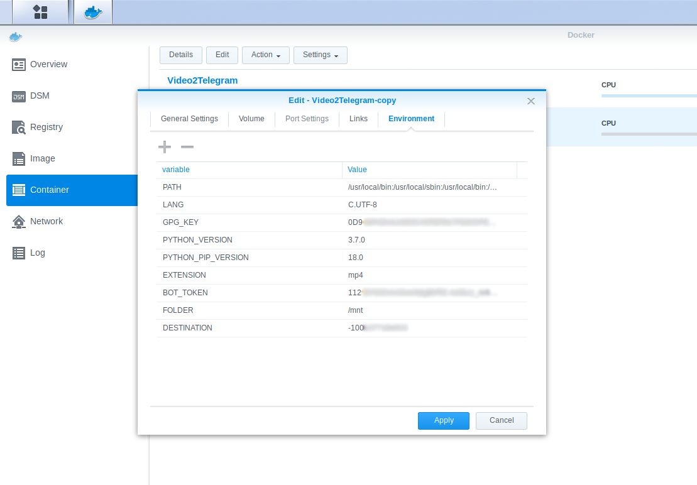

# Video to Telegram


* [About](#about)
* [Setup](#setup)
  * [Docker Compose](#docker-compose)
  * [Python](#python)
  * [Synology Docker](#synology-docker)
* [Contribute](#contribute)
* [Contact](#contact)

## About

This docker container checks if a new file is created on a folder and sends it to a person/group/channel using [Telegram Messenger](https://telegram.org).

The idea behind this project is to send me a gif everytime my camera get movement. The camera is pointed to my door, this way I can see on real time who is entering or leaving my place. Also, another unexpected benefit of using this project is to have a cloud backup of my camera for free. 

## Setup

### Docker Compose

```
file2gif:
    image: gabrielrf/video2telegram
    environment:
        - BOT_TOKEN=
        - FOLDER=/
        - EXTENSION=mp4
        - DESTINATION=
    restart: always
    volumes:
        - host_folder:container_folder
```

`BOT_TOKEN`: Token given by [@BotFather](https://t.me/BotFather) on Telegram.

`FOLDER`: Folder that will be monitored by the script. In case of a folder tree, set the top-level folder.

`EXTENSION`: The extension of the file that should be sent. Usually `mp4` is the case.

`DESTINATION`: To whom the message will be sent.

`volumes`: The same folder used on `FOLDER`:Some folder that exists on the container. Suggested: `/mnt`

### Python

First, run 

```
pip install inotify
pip install pytelegrambotapi
```

to install the libraries needed. Then, open `file2gif.py` and make the necessary adjustments on `BOT_TOKEN`, `FOLDER`, `EXTENSION` and `DESTINATION` as listed above. 

Run the Python Script.

```
python file2gif.py
```

### Synology Docker

Open the Docker App on your Synology Device. On `Registry`, look for `video2telegram` and double click the result to download the image. 


On the `Image` tab, check if the download is completed. Once completed, double click the image and set it as follows.



`Container Name` is optional. `Enable auto-restart` is recommended.
Click on `Advanced Settings` and go to tab `Volume`. Click on `Add Folder` and find your camera folder. 



Click on `Select`. Go to tab `Environment` and add 4 variables: `BOT_TOKEN`, `FOLDER`, `DESTINATION` and `EXTENSION`. Check [Docker Compose](#docker-compose) topic for details.

Your settings should look similar to this image:



Click on `Apply` and it should be ready and running.

## Contribute

Pull requests and issues are welcome! 

## Contact me

[GabRF.com](https://gabrf.com)

[@GabrielRF](https://t.me/gabrielrf) on Telegram.
